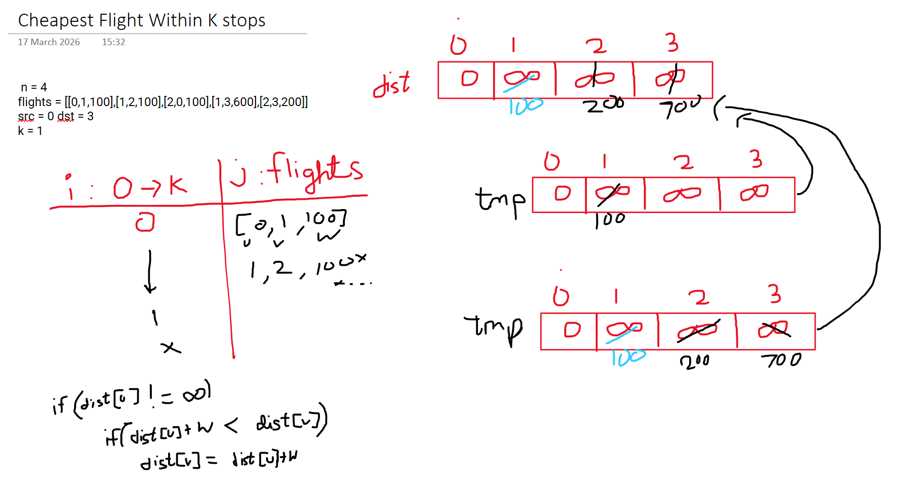

The Bellman-Ford algorithm is essentially the "brute force" version of shortest-path discovery. While algorithms like Dijkstra are "greedy" (picking the best-looking option immediately), Bellman-Ford is "thorough"—it assumes that any edge could eventually lead to the best path.

---

## The Intuition: The "Grapevine" Analogy

### Simplified Explanation

Imagine you are in a small town and you want to know the fastest way to get to the "Town Square."

1. **Step 0:** Only people standing _at_ the Town Square know they are 0 minutes away. Everyone else says, "I have no idea, let's say infinity."
    
2. **Step 1:** You ask everyone who is exactly **one** block away from the square how long it takes. They tell you (e.g., 5 minutes). Now, anyone 1 block away knows their time.
    
3. **Step 2:** You ask people who are **two** blocks away. They talk to the people from Step 1, add their walking time, and now _they_ know their time.
    
4. **The Rule:** You repeat this "gossip" phase. If someone hears a new route that is faster than their current one, they update their notes.
    

### Real-World Example: RIP (Routing Information Protocol)

Routers on the internet use a version of this. Every router tells its neighbors, "Here is how long it takes me to reach Google." The neighbors take that info, add the cost to reach that router, and update their own tables. They keep doing this until everyone agrees on the fastest paths.

---

## The Technical Approach: "Relaxation"

In technical terms, the heart of Bellman-Ford is **Edge Relaxation**.

### 1. The Principle of $N-1$ Iterations

In a graph with $V$ vertices, the longest possible shortest path (without cycles) has $V-1$ edges. Therefore, if we look at every single edge in the graph and try to "relax" it $V-1$ times, we are mathematically guaranteed to find the shortest path to every node.

**The Relaxation Formula:**

For an edge $(u, v)$ with weight $w$:

$$dist[v] = \min(dist[v], dist[u] + w)$$

### 2. Handling the $K$-Stops Constraint

In the some problems, we don't relax $V-1$ times. We relax exactly **$K+1$** times.

- **1 iteration** = Shortest path using 1 edge (0 stops).
    
- **2 iterations** = Shortest path using up to 2 edges (1 stop).
    
- **$K+1$ iterations** = Shortest path using up to $K+1$ edges ($K$ stops).
    

### 3. The "Two-Array" Architecture

- **Standard Bellman-Ford:** Often uses one array because "over-learning" (finding a path with more edges than the current iteration) is actually a good thing—it gets you to the answer faster.
    
- **$K$-Stops Bellman-Ford:** Must use two arrays. We need to "freeze" the results of the previous iteration so that in iteration $i$, we only extend paths that were exactly $i-1$ edges long.
    

---

## Key Takeaways

|**Feature**|**Bellman-Ford Logic**|
|---|---|
|**Philosophy**|**Dynamic Programming:** Builds the solution for $k$ edges using the solution for $k-1$ edges.|
|**Superpower**|Can handle **negative weights**. Dijkstra fails here because it's too "greedy" to turn back.|
|**Detection**|If you relax a $V^{th}$ time and distances _still_ decrease, you've found a **negative cycle**.|
|**Complexity**|Time: $O(V \times E)$. It's slower than Dijkstra but more robust.|
|**Constraint**|When a "max edges" or "max stops" limit is given, Bellman-Ford is usually the most direct architectural fit.|

---
