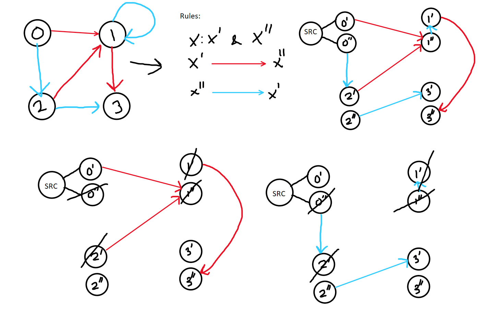

## Problem
Each edge is red or blue in this graph, and there could be self-edges and parallel edges.
Return an array `answer` of length `n`, where each `answer[x]` is the length of the shortest path from node `0` to node `x` such that the edge colors alternate along the path, or `-1` if such a path does not exist.

## Solution
This is a **STATE SPACE** Graph problem. Here the Graph is transformed into a new Graph which manages a State. 
Here we enforce two Rules:
* X' -> X" : Red Edge
* X" -> X' : Blue Edge

By expanding the graph  , the paths look more clear and there is no overlapping paths now. 
We use BFS to calculate shortest path as the cost is 1 for each edge.

### **Crucial :** 
* Maintain two Graphs, `redGraph` & `blueGraph`, and traverse in both of them alternatively.
* Queue must contain the state representation of each node: `{ node, cost, lastPathColor }`
* Visited would be a matrix of 2 columns. [RED, BLUE]. If a path is coming from **BLUE** then we check if `vis[u][RED] == false`.
* Push _two_ entries for node 0 into the queue at the start: `(0, 0, RED)` and `(0, 0, BLUE)`.

---
### Key Takeaways

- **State is more than just Location:** In many complex BFS/Dijkstra problems, the "state" includes metadata (like the last move, keys collected, or fuel remaining). If the future depends on the past, that past must be part of your state.
    
- **Visited Array Dimensions:** Your `visited` array must match the dimensions of your state. If your state is `(node, color)`, your visited array must be `[N][2]`.
    
- **Multi-Source Initiation:** Since we don't know if the shortest path starts with a Red edge or a Blue edge, we "seed" the queue with both possibilities at distance 0. This is a common pattern for "either/or" starting conditions.
    
- **BFS Optimality:** The $O(V + E)$ efficiency is preserved because we still only visit each "state" once, even if that means visiting each physical "node" twice.
